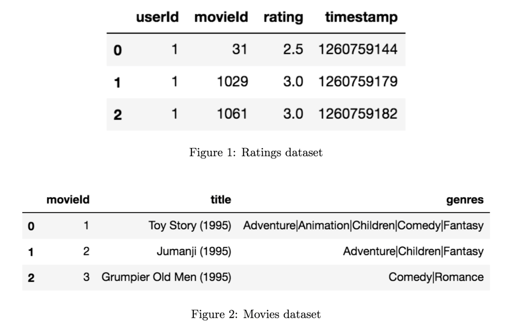
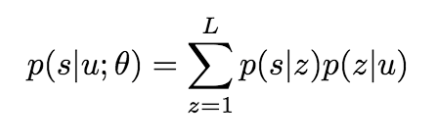
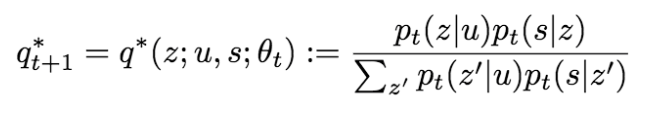
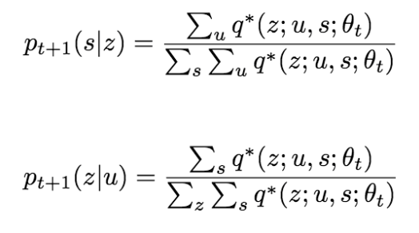
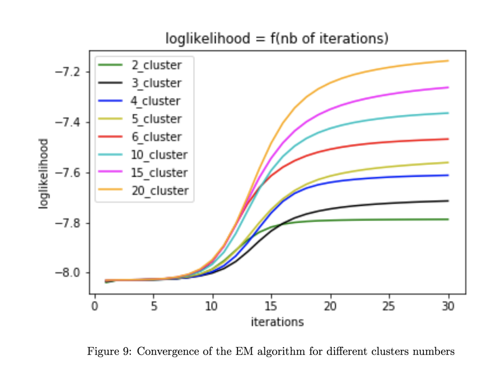
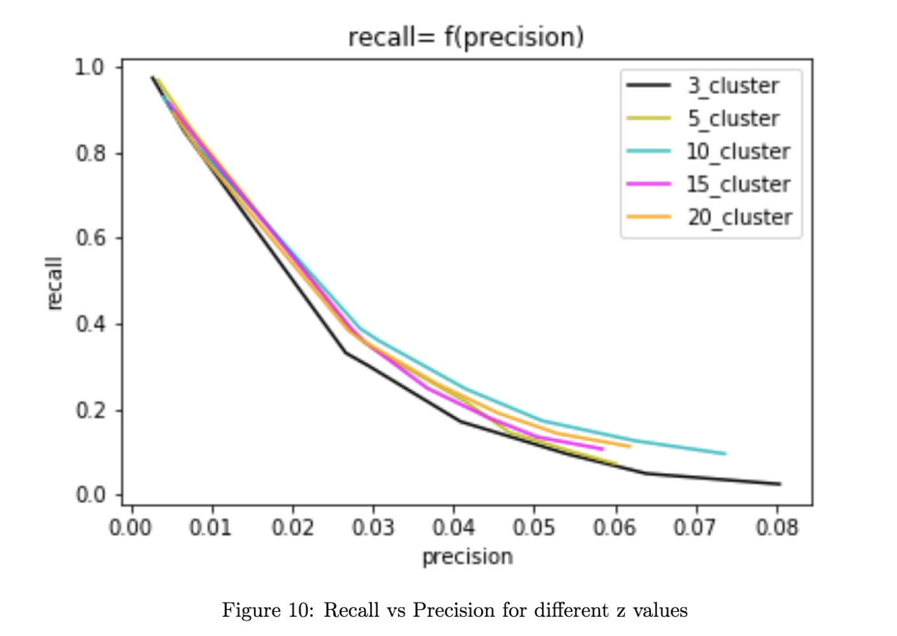

# PLSI

Collaborative filtering is a technique that aims at learning user preferences and making recommendations based on user and community data. In this project, we ([Amir](https://github.com/amirbenmahjoub), [Clément](https://github.com/clemonster) and [I](https://github.com/SachaIZADI) implemented [Das & al. (2007)](http://citeseerx.ist.psu.edu/viewdoc/download?doi=10.1.1.80.4329&rep=rep1&type=pdf) MapReduce formulation of PLSI, a collaborative filtering algorithm. 

This algorithm was one of the building bricks of the Google News recommender system. 

We first clarify the statistical foundations of the algorithm by expliciting the maths behind it, before implementing it in Spark on a small fraction of the database [MovieLens](https://grouplens.org/datasets/movielens/). We then scale the algorithm for running it on an AWS cluster.

## PLSI in a few words

Full details of our work are available in this repo, but to put it in a nutshell.

We worked on the MovieLens dataset which looks like:

The probalistic framework of the algorithm is the following: we aim at computing the probability that a user `u` views a film `s` and we introduce a latent variable `z` that can be interpreted as clusters of like-minded users and similar movies.

To learn these probability distributions, we use the Expectation-Maximization algorithm (EM) that consists in alternating the two steps :

- Expectation:

- Maximisation:

At the end of the day we showed the convergence of our algorithm (by computing the loglikelihood of our model):

And obtained a ROC curve (which is not as good as expected, but we computed it on a very limited fraction of MovieLens ... the version we ran on AWS was actually far more convincing).

